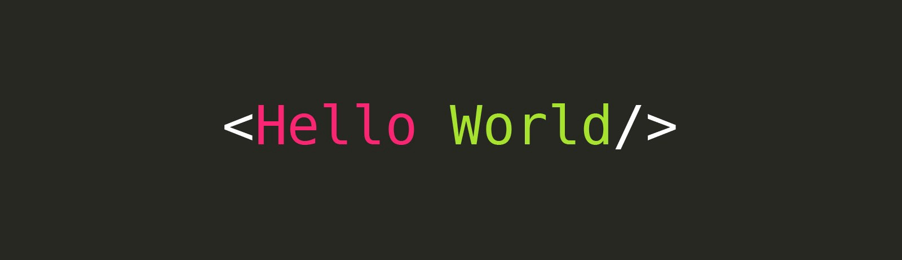

<h1 align="center">I'm Daniel👋!</h1>

## Whoami
I'm a self-taught web dev from Venezuela 🇻🇪. 

### About me 💡
- Born in the '96
- Father of three (🐱🐱🐶)
- Former [Odin Project](https://www.theodinproject.com/) and [Frontend Mentor](https://www.frontendmentor.io/) member
- Very into the cycle of `Think ➡ Desing ➡ Create ➡ Test ➡ Build ➡ Deploy`

### Currently learning 🌱
- TypeScript & Angular 2+

### Tech stack 🧱
         
          

|  |  
|--|---|

### Open to work 👨‍💻
- [FEM Profile](https://www.frontendmentor.io/profile/rwxdan)
- 

### 🗣
-  
- 
